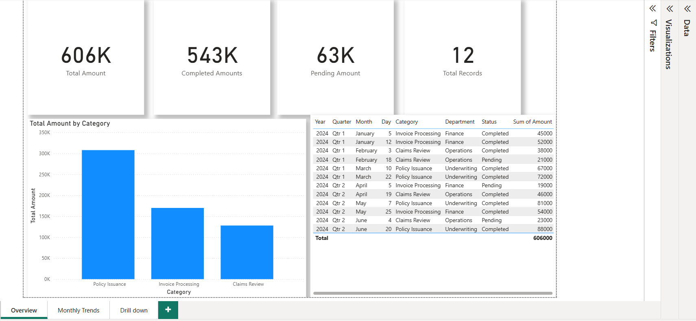
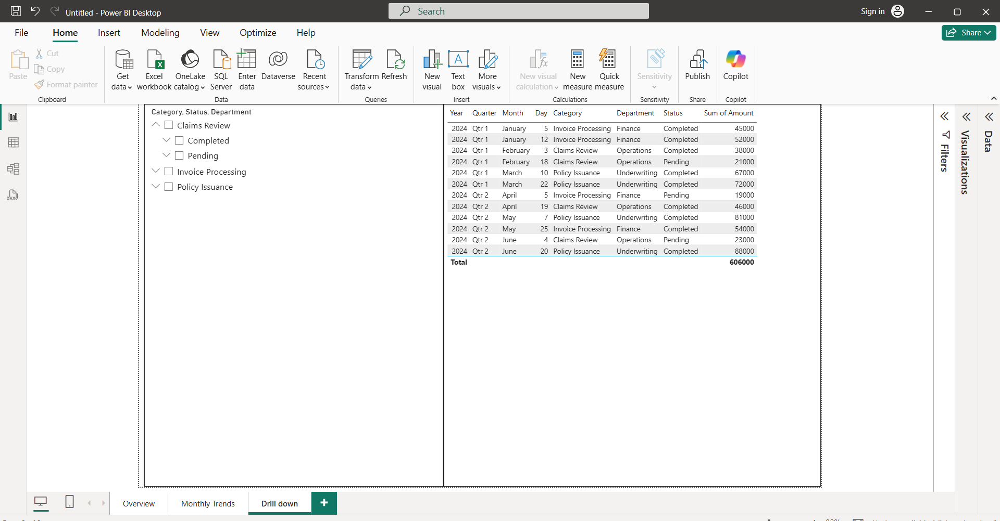

# Excel VBA & Power BI Reporting Automation

## Problem Statement
Manual operational and financial reporting required repetitive data cleaning and report preparation, leading to delays and errors.

## Solution
Built an automated reporting solution using Excel VBA and Power BI to clean raw data, generate reports, and visualize KPIs.

## Tools Used
- Microsoft Excel (VBA, Macros)
- Power BI (Data Modeling, DAX)
- Power Query

## Key Features
- One-click VBA macro to clean and prepare raw data
- Automated report generation using Excel
- Power BI dashboard with KPIs, trends, and drill-downs
- DAX measures for performance analysis

## Impact
- Reduced manual reporting effort by ~20%
- Improved accuracy and turnaround time of reports

## How to Run
1. Open the Excel file
2. Click the "Run Automation" button
3. Refresh Power BI dataset

## Dashboard Preview

### Overview Dashboard

### Monthly Trends

### Drill-down View

